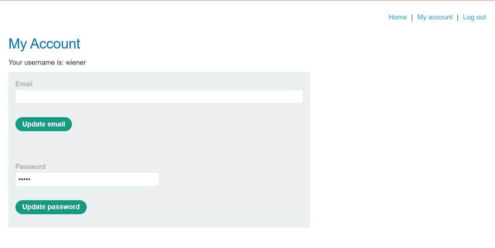

# Access Control - Lab 5: User ID Controlled by Request Parameter with Password Disclosure

## Description
This lab has user account page that contains the current user's existing password, prefilled in a masked input.

To solve the lab, retrieve the administrator's password, then use it to delete the user `carlos`.

You can log in to your own account using the following credentials: `wiener:peter`

We are back on our shop page. If we log in with the credentials we were given, we can now see we have a place to reset our password:

Now, if we go to the URL and change the account id to `carlos`, we can see that we have access to his account and can see his masked password.

If we then inspect the source code, we see that's it's still in plaintext:

Knowing we can do this, we can test this with common admin names like `admin` or `administrator` and see if we get a password.

After testing this, we see that `administrator` is a real account and if we check their password, we can see it is `wqnq7vfl6fzwxoth3avx`

Now we just go back to the login portal, give the administrator credentials, go to the admin panel, and delete the user `carlos`.