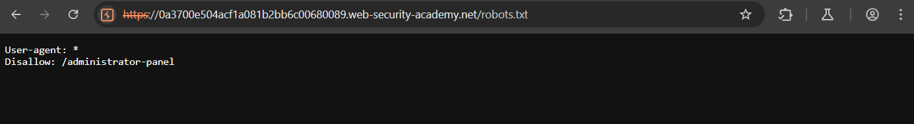
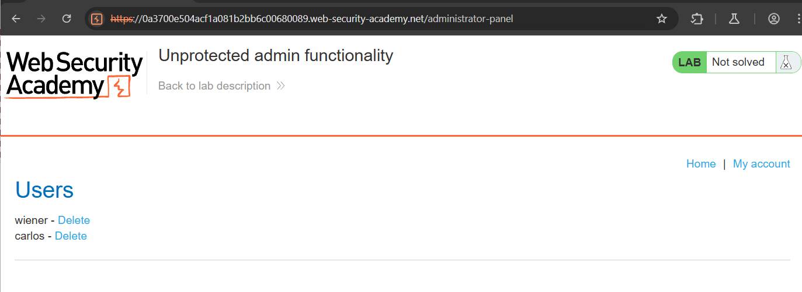

## Access Control - Lab 1: Unprotected Admin Functionality

### Description

This lab has an unprotected admin panel.

Solve the lab by deleting the user `carlos`.

Starting web page:

Since we have a page, and were given the information that there's an unsecured admin panel, the first place we could check is `robots.txt` to see if there are any pages that are hidden from web crawlers, but not from us.

Here we can see there is a page called `/administrator-panel`

If we navigate to that page we can see some admin functions to delete users and our target `carlos` is here.

Deleleting the user `carlos` will solve the lab.