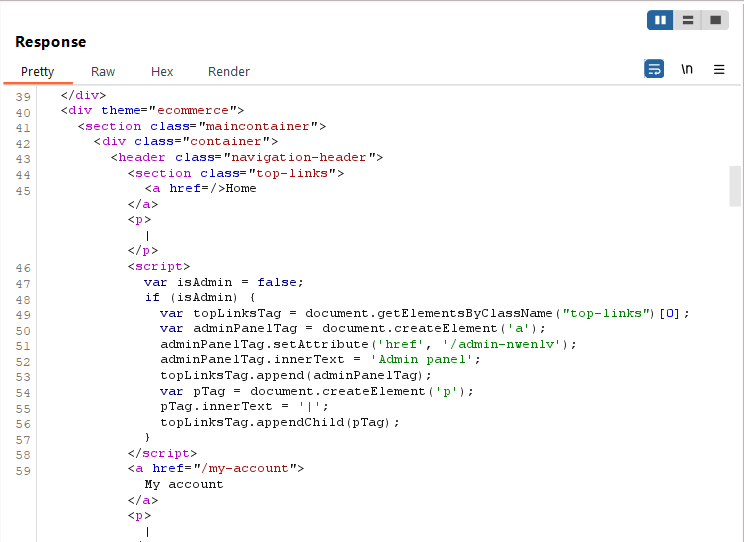

# Access Control - Lab 2: Unprotected Admin Functionality with Unpredictable URL

## Description

This lab has an unprotected admin panel. It's located at an unpredictable location, but the location is disclosed somewhere in the application.

Solve the lab by accessing the admin panel, and using it to delete the user `carlos`.

Starting page:

This has the same page as the previous lab, however this time there is no `robots.txt` file.

However, when we look at the source code of the page, we can see some JavaScript that runs on load:

Inside we see that if the user is an admin, it will build based off the `/admin-nwenlv` page. 

If we navigate to that page, once again we see the admin panel and can delete the target and solve the lab.

