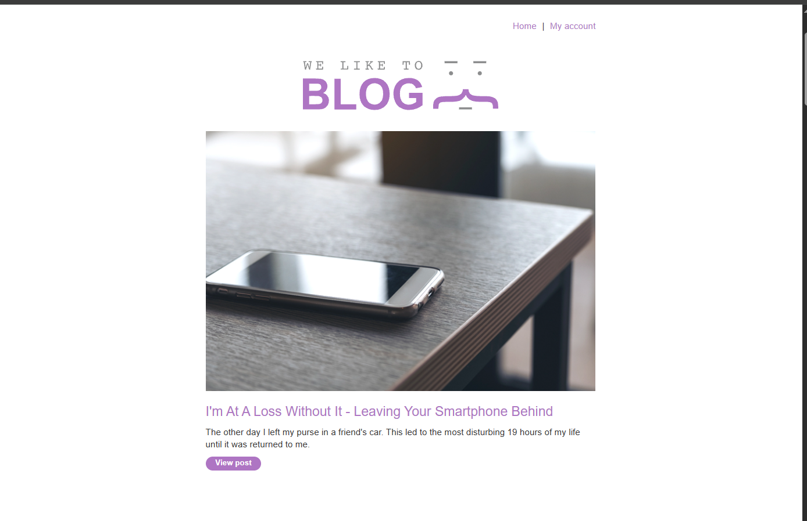
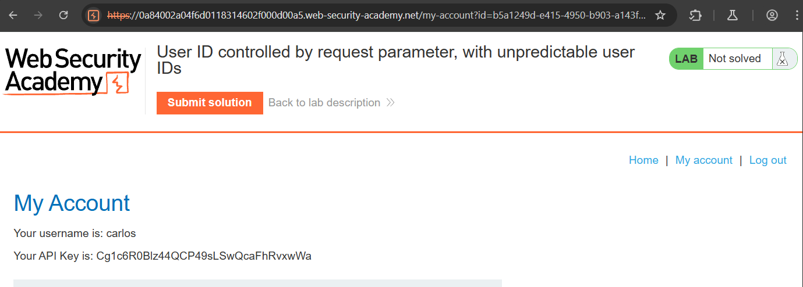

# Access Control - Lab 4: User Controlled by Request Parameter with Unpredictable User ID

## Description
This lab has a horizontal privilege escalation vulnerability on the user account page, but identifies users with GUIDs.

To solve the lab, find the GUID for `carlos`, then submit his API key as the solution.

You can log in to your own account using the following credentials: `wiener:peter`

When we navigate to this site, we get a blog page:

Since we have user credentials, if we sign in with them, we get a user account page that has our name, our API key (`4HCqsjyREegzPNsBN9jBOYWWVNomG7h4`), and we can see we have a custom URL: `5aa3e0b5-aafe-41d9-a96d-b2222698e4e8`

If we go through the blogs, we can actually see that one of them was written by carlos, and the author name is clickable. Clicking on this takes us to the URL:
`https://.web-security-academy.net/blogs?userId=b5a1249d-e415-4950-b903-a143f9374df3`

This means we can see what his GUID is.

If we take that and go back to our account page (on `/my-account?id=XXXX`) and plug in his GUID, we will access his account page and see his API Key:

From there we submit it as the lab requests and the lab is complete.