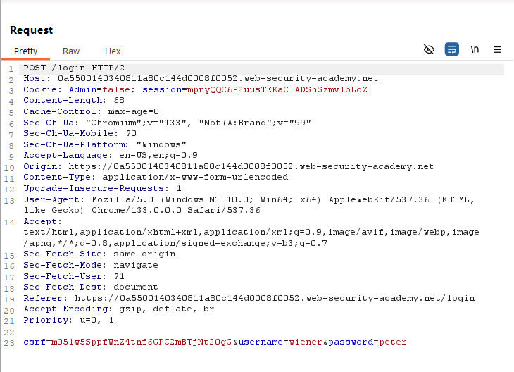
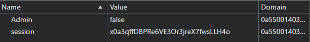
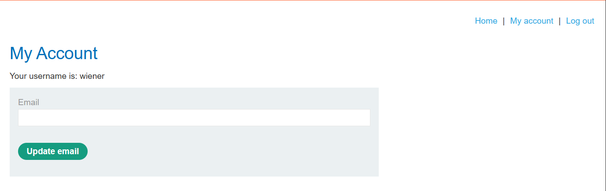
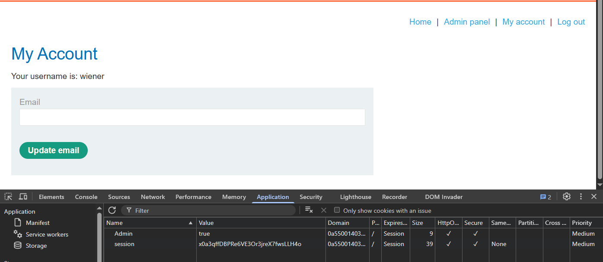

## Access Control - Lab 3: User Role Controlled by Request Parameter

### Description

This lab has an admin panel at `/admin`, which identifies administrators using a forgeable cookie.

Solve the lab by accessing the admin panel and using it to delete the user `carlos`.

You can log in to your own account using the following credentials: `wiener:peter`

When we go to access this application, we get the same shop, only this time, we have credentials now.

Going to the login page and signing in, we can see some interesting stuff in our requests. 

When we log in, we can see in our request that a cookie is set: `Admin=false`

And if we go to the cookies in our browser, we can see that this has been set with our session:

Now, looking at our current user page, we can only go to the home page, the page we are on, log out, or update our email.

But if we change that cookie to true and refresh the page, we get another link to the admin panel.

From here we can  delete the user `carlos` and solve the lab.