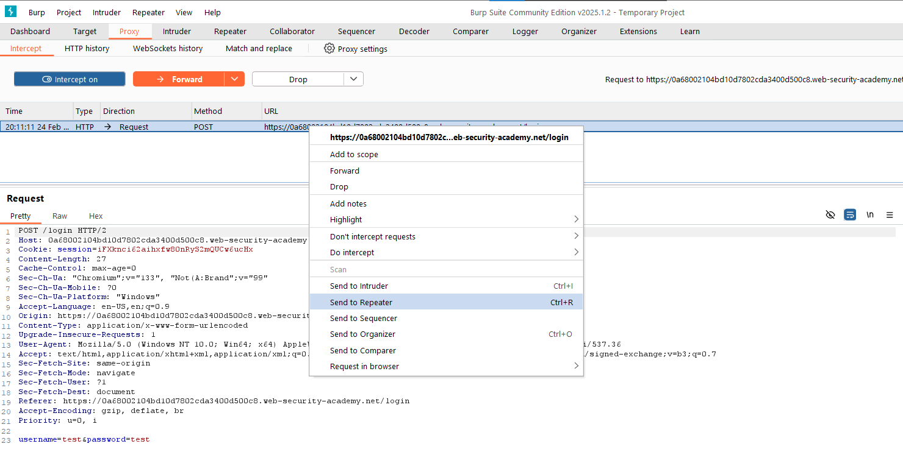
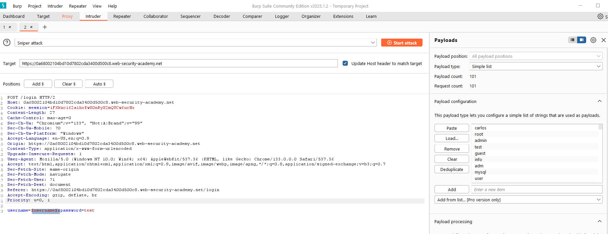
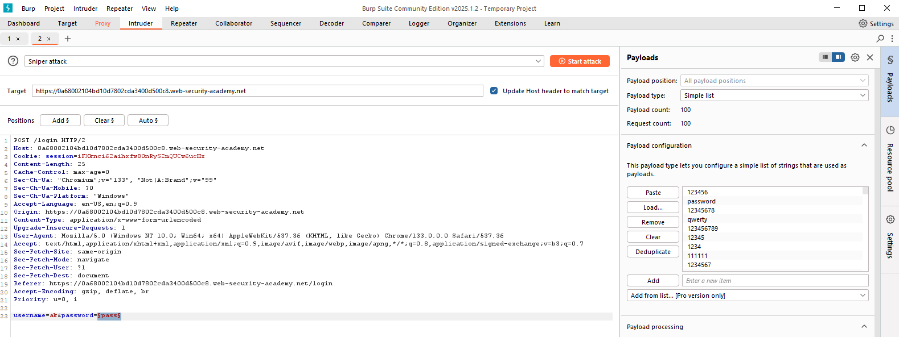
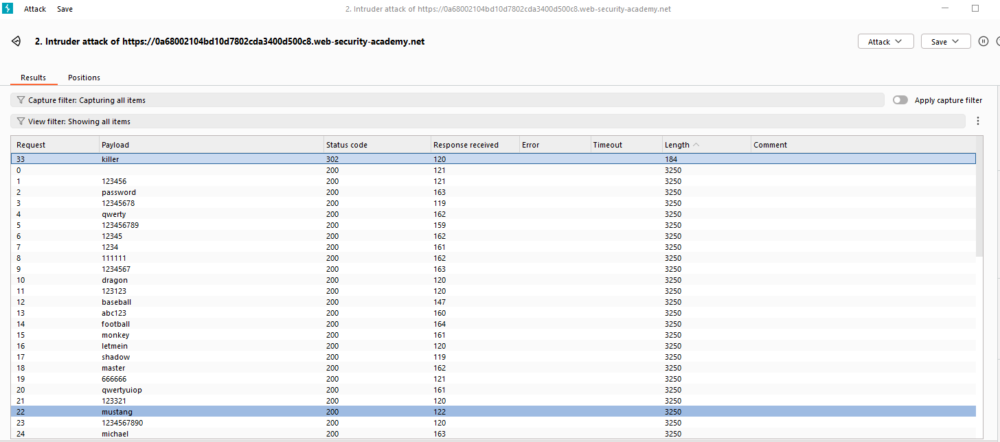

## Authentication - Lab 1: Username Enumeration via Different Responses

### Description
This lab is vulnerable to username enumeration and password brute-force attacks. It has an account with a predictable username and password, which can be found in the following wordlists:

- `Candidate usernames`
- `Candidate passwords`

*I have included the wordlists in the lab materials section at the end of this paper.*

To solve the lab, enumerate a valid username, brute-force this user's password, then access their account page.

When beginning this lab, we get the blog page that we have been in prior labs. Since our task is to enumerate a username first, the best place to start is the login page. From here we will want to turn on Intercept on BurpSuite and capture trying to submit a login request and send it to the Intruder.

Once we are in the Intruder, we will want to mark the username field to be fuzzed and load the username list given.

While that is running, we will see that every request is getting a 200 response. However, if we filter by the length of the response, we will see one username recieved a length of 3250, while all the others are 3248. Examining the responses, we can see that the 3248 length responses are giving us an "Invalid username" response, while the 3250 length responses are giving us a "Invalid password" response. This means that the username `ak` is correct, now we just need to brute-force the password.

To brute-force the password, we do the same thing but instead of fuzzing the username, we statically set it to `ak` and fuzz the password, load the password list, and start the attack.

Now we do the same thing and look for notible differences. Only this time, we notice the different length is 184 and not 3250. This response is tied to the password `killer`

With the username and password in our possession, we can now log in to `ak`'s account and complete the lab.