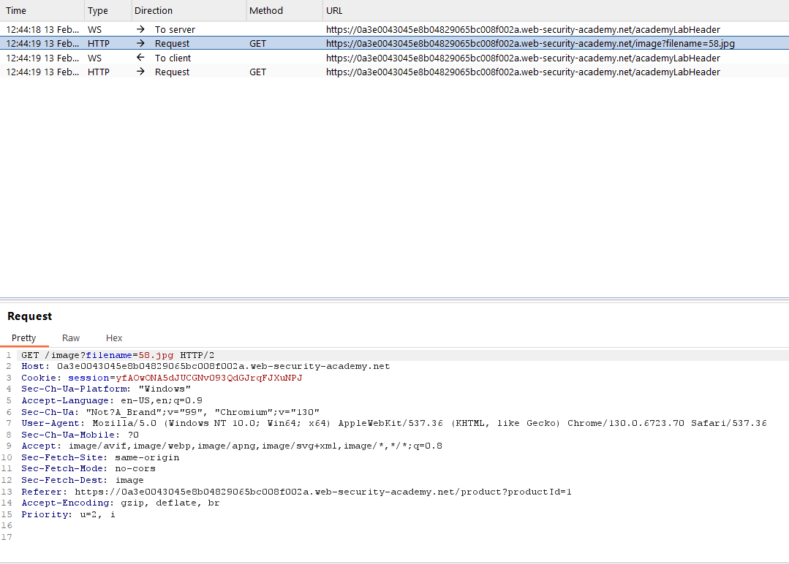
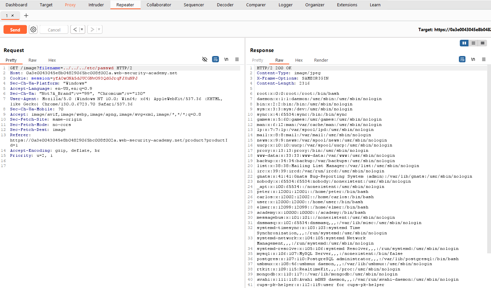

## File path traversal - Lab 1: Simple Case

### Description
This lab contains a path traversal vulnerability in the display of product images.

To solve the lab, retrieve the contents of the `/etc/passwd` file.

Starting web page:


After clicking a product:

- Page URL: `https:XXXXX.web-security-academy.net/product?productId=1`
- Page:


Looking in the source code for this page we can see the following HTML:

```html
<section class="product">
    <h3>There is No 'I' in Team</h3>
    
    <div id="price">$92.88</div>
    
    <label>Description:</label>
    <p>...</p>
    <p>...</p>
    <p>...</p>
    <p>...</p>
    <div class="is-linkback">
        <a href="/">Return to list</a>
    </div>
 </section>
```

Here we can see two places that might be vulnerable to path traversal:

- The `src` attribute of the `img` tag for the image of the product
- The `src` attribute of the `img` tag for the rating

Opening the site in BurpSuite and intercepting the request to load we will see the following GET request:



Now if we send this to the repeater and change the `filename` parameter to `../../../../etc/passwd` we will see the following response:


