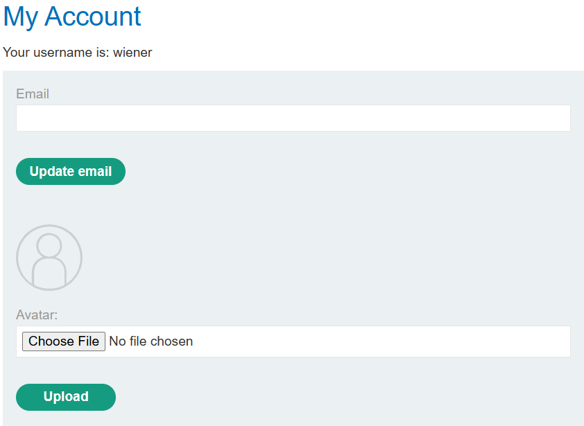
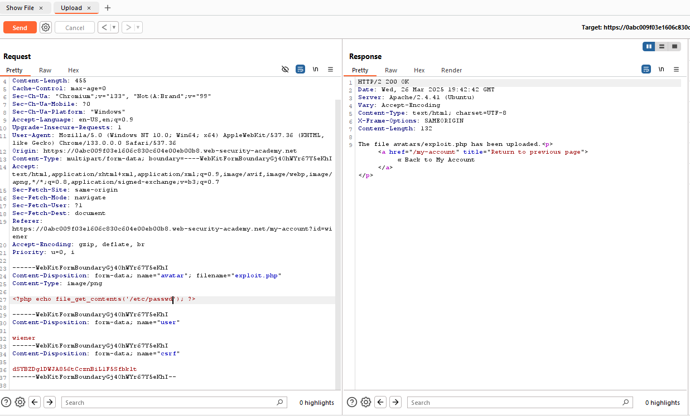
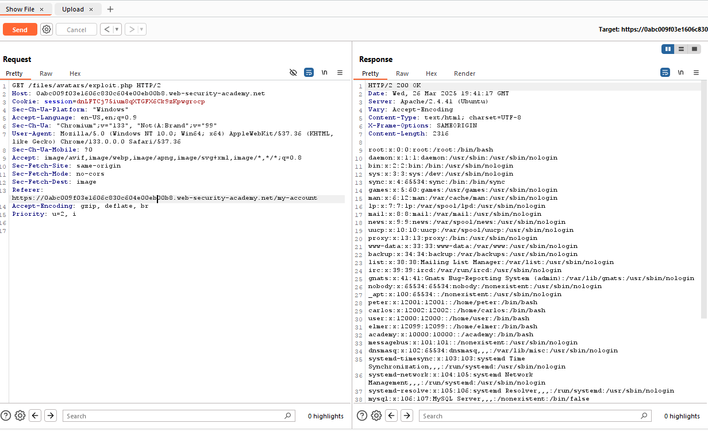

## File Upload Vulnerabilities - Lab 1: Remote  Code Execution via Web Shell Upload

### Description
This lab contains a vulnerable image upload function. It doesn't perform any validation on the files users upload before storing them on the server's filesystem.

To solve the lab, upload a basic PHP web shell and use it to exfiltrate the contents of the file `/home/carlos/secret`. Submit this secret using the button provided in the lab banner.

You can log in to your own account using the following credentials: `wiener:peter`


When we visit the page and sign in, we can see we have the option to upload a file as our profile picture:



If we upload a random image and then check in our HTTP history on BurpSuite, we can see that the site makes a `GET` request to `/files/avatars/FILE_NAME` (with `FILE_NAME` being the name of the file we uploaded).

Then we can create a simple PHP web shell:

```php
<?php echo file_get_contents('/home/carlos/secret'); ?>
```
and upload it.

Now, we can also do all of this through the repeater in BurpSuite.



This shows that the website took our file `exploit.php` and saved it with the contents that establish our shell which reads `/etc/passwd`.

Now to test this, we can use the repeater to send a request to `/files/avatars/exploit.php`.



So to solve the lab, we just need to change our exploit to read `/home/carlos/secret` instead of `/etc/passwd` and send both requests.

This gives us the secret flag which we can then submit to solve the lab.