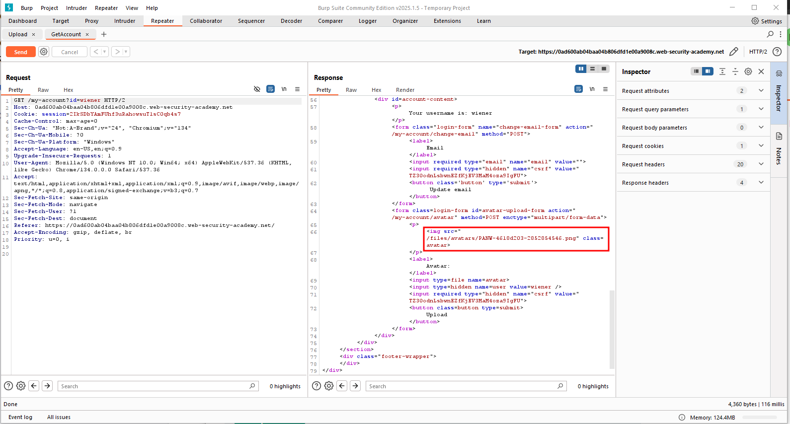
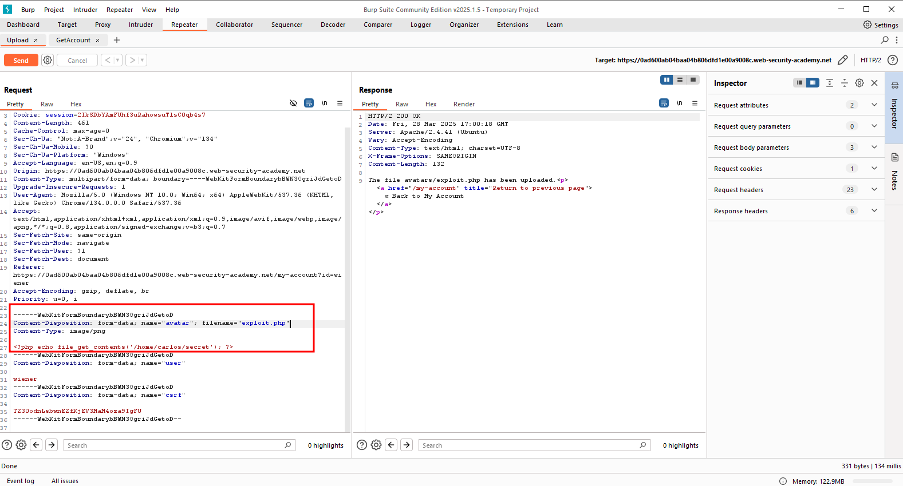

## File Upload Vulnerabilities - Lab 2: Weeb Shell Upload via Content-Type Restriction Bypass

### Description
This lab contains a vulnerable image upload function. It attempts to prevent users from uploading unexpected file types, but relies on checking user-controllable input to verify this.

To solve the lab, upload a basic PHP web shell and use it to exfiltrate the contents of the file `/home/carlos/secret`. Submit this secret using the button provided in the lab banner.

You can log in to your own account using the following credentials: `wiener:peter`

This is a similar problem as the previous lab. However in this one, we don't get a `GET` request to the file. However, it is still reflected in the response when we load our user page.

Now if we try to upload a PHP file as we did before

and look at our traffic history, now it is loading `files/avatars/exploit.php`.

Looking at this response shows the secret as it did before.

### Important Note
This worked because the method we used was modifying the request directly, not uploading a php file. If we had done that, the `Content-Type` would have been automatically detected. However, we left it as `image/png` which is approved by the server.

Our submission of data that was not a png as a png file is what caused the server to mishandle it and give us the `GET` request.