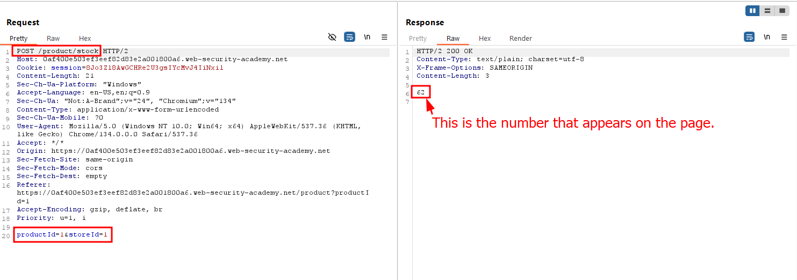
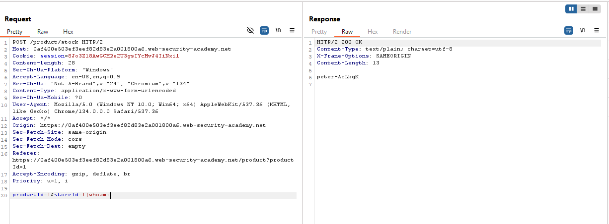

## OS Command Injection - Lab 1: OS Command Injection Simple Case

### Description
This lab contains an OS command injection vulnerability in the product stock checker.

The application executes a shell command containing user-supplied product and store IDs, and returns the raw output from the command in its response.

To solve the lab, execute the `whoami` command to determine the name of the current user.

Since we know that the vulnerability lies in the stock checker, the first thing we should do is see what the normal behavior is.

Going to a random product and selecting a store will return the number in stock. When we look at this request, we can see it does this through a `POST` request to `/product/stock` with two parameters: `productId` and `storeId`.

However, if we modify the parameters to include a UNIX command, we can see that we have influence on the output.

In this case, we use the `|` to separate the commands. The first command is `whoami`, which returns the current user.