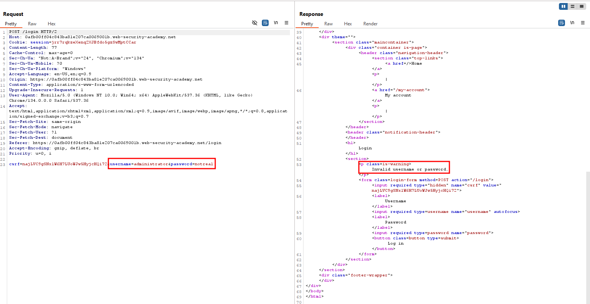
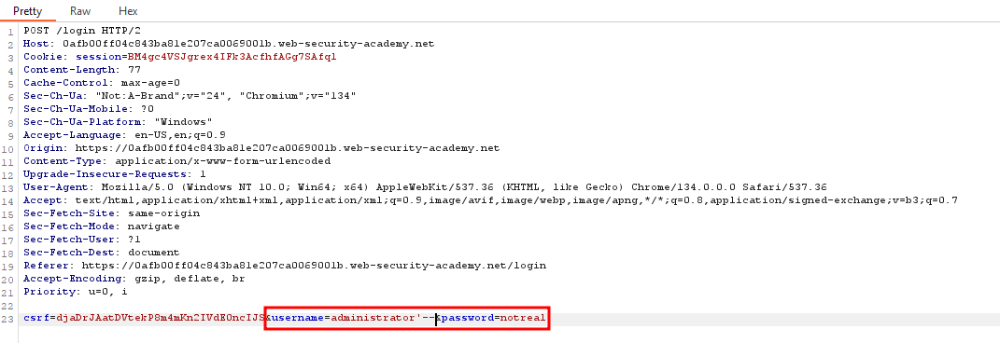
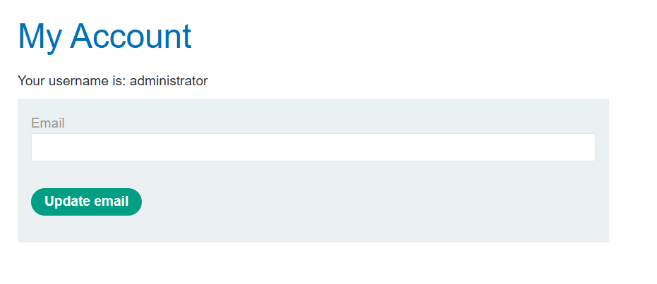

## SQL Injection - Lab 2: SQL Injection Vulnerability Allowing Login Bypass

### Description
This lab contains a SQL injection vulnerability in the login function.

To solve the lab, perform a SQL injection attack that logs in to the application as the `administrator` user.

To begin this lab, we are going to attempt to sign in with the credentials `administrator:notreal` to see what the request looks like.



As we can see, this says we have an invalid username or password.

Attempting a SQL inject, we can try to modify our request to attempt to ignore the password check by intercepting the request and making some changes.



Here, we have modified the username to be `administrator'--`. This will cause the SQL query to look like:

```sql
SELECT * FROM users WHERE username = 'administrator'--' AND password = 'notreal'
```

When we forward this request, we can see that we have successfully logged in as the administrator.


