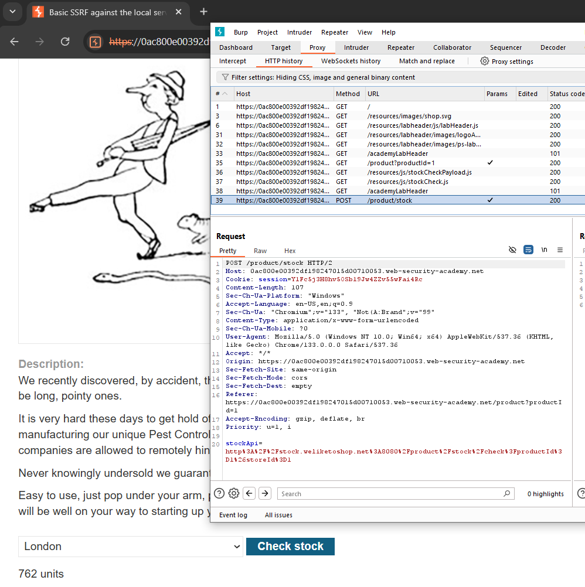
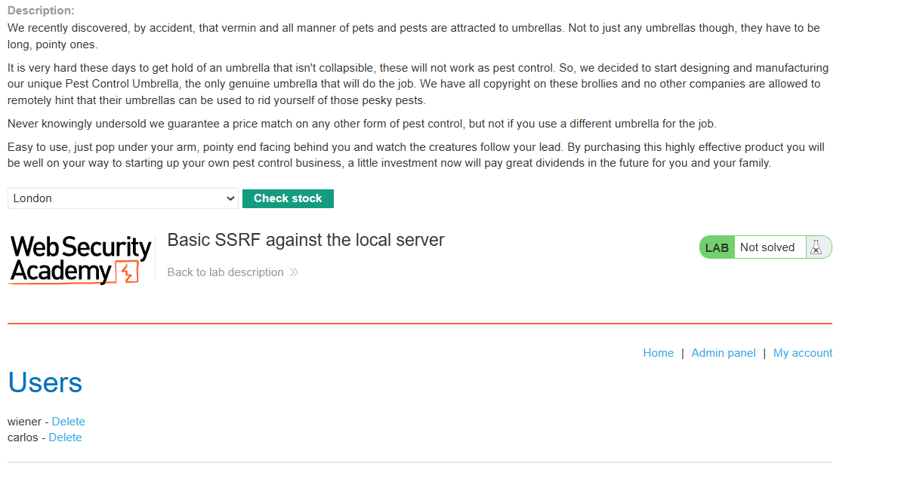

## SSRF - Lab 1: Basic SSRF Against Local Server

### Description
This lab has a stock check feature which fetches data from an internal system.

To solve the lab, change the stock check URL to access the admin interface at `http://localhost/admin` and delete the user `carlos`.

Looking at the store page, when we view a product we can select the location and then view the stock. 

If we check the stock for a product and go to our HTTP history, we can see the request is attempting to send a call to a `stockAPI`.



If we intercept that request and change the value `stockAPI` to `http://localhost/admin` we can see the admin page appear where the stock is supposed to.



From here, we can see that if we were to delete `carlos`, it would send a request to `https://XXX.web-security-academy.net/admin/delete?username=carlos`. If we try to just click it here, we get an error saying:

```
Admin interface only available if logged in as an administrator, or if requested from loopback
```

To circumvent this, we will go back to the stock check page, and when we check the stock again, we will now change the request link to go to: `http://localhost/admin/delete?username=carlos`.

Doing this completes the lab.